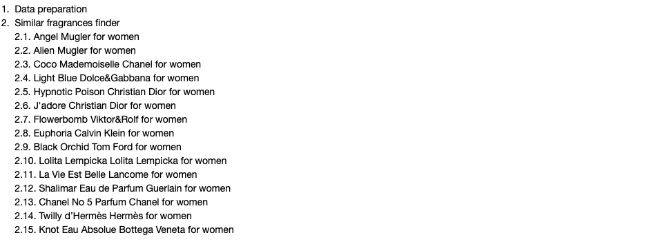

# fragrance-finder
Content-based recommendation system for female fragrances

      
  

## Table of contents
* [General info](#general-info)
* [Technologies](#technologies)
* [Setup](#setup)
* [Results](#results)
* [Status](#status)

## General info
Content-based recommendation system on 39.7K female fragrances.

## Technologies
Project is created with Python - version: 3.8.5.

Python libraries:
* fuzzywuzzy - version 0.18.0
* pandas - version 1.1.1
* seaborn - version 0.11.0
  
## Setup

Input data: hierarchical_result.csv, this is the end result of the https://github.com/katarzynajanicka/agglomerative-fragrance-clustering project.

Output data: fragrance_finder.ipynb (Jupyter notebook)

## Results

**Project structure**

**Data structure**

**Most popular fragrances**

**Findings**

**Angel Mugler for women**

## Status
Project is in progress.

 
